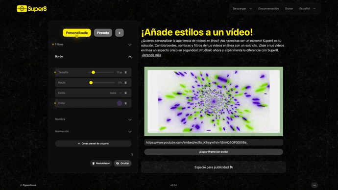

# Filters

## 🎞️ Filters

Shadow filters allow you to adjust saturation, contrast, brightness, hue, and other visual aspects of the element to achieve unique effects.

### Saturation

Adjust saturation to change the intensity of colors in the element. You can achieve vibrant or desaturated effects according to your preferences.

### Contrast

Contrast controls the difference between lights and shadows in the element. Increase contrast to highlight visual details.

### Brightness

Brightness controls the amount of light in the element. Increase brightness to make the element appear brighter.

### Hue

Hue allows you to change the color tones in the element. You can create artistic and unique effects with this setting.

### Blur

Blur is useful for smoothing the appearance of the element. Adjust this option to achieve a soft and pleasant look.

### Sepia

The sepia effect gives the element a vintage and nostalgic look. Adjust this setting to achieve the desired level of sepia.

### Invert

The inversion effect reverses the colors in the element. You can create interesting and surprising results with this option.

## 🖼️ Border

The border filter allows you to customize the appearance of the border around the element. You can adjust its size, roundness, and style to perfectly match your preference.

### Border Side

This option allows you to choose the side of the element to which the border will apply. You can configure it to be displayed on one or multiple sides, depending on your needs.

### Border Radius

The border radius determines how rounded the edges of the element will be. You can smooth out the edges or make them more angular, depending on your visual style.

### Border Style

You can select the style of the border that you like the most. Options include "Solid" "Dashed" "Double" etc, giving you the flexibility to choose the visual effect you desire.

### Border Color

Choose a color for the border. You can fully customize the appearance of the border by selecting the color that best suits your overall design.

## 🌗 Shadow

Shadow is an effective way to highlight the element on the page. You can adjust the shadow to create an elevation effect and add depth.

### Shadow Shift horizontal

Control the horizontal position of the shadow. Adjust this value to determine the direction from which the light comes and create realistic shadows.

### Shadow Shift vertical

Shadow shift vertical controls the vertical position of the shadow. Play with this value to achieve the desired elevation effect.

### Shadow Spread

Shadow spread determines how far the shadow extends from the element. Increase this value to make the shadow more pronounced.

### Shadow Blur

Shadow blur controls the sharpness of the shadow's edges. Adjust this value to create soft or defined shadows.

### Shadow Inset

The shadow inset option allows you to simulate a relief effect on the element. You can adjust this setting to make the element appear as if it's carved into the page.

### Shadow Color

Choose a color for the shadow. You can fully customize the appearance of the shadow by selecting the color that best fits your overall design.

## 🔄 Reset and Show/Hide

There is also the option to reset and hide the filters.

---

These controls allow you to fully customize the appearance and style of elements on your web page, providing a high degree of creativity and flexibility.
