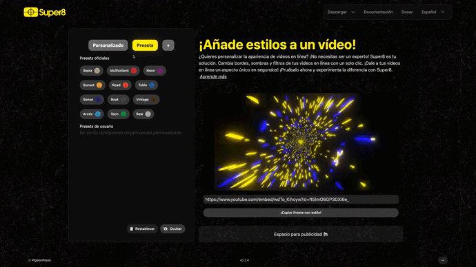

# Presets

Presets are **Super8** style configurations.

## 📚 Types of Presets

There are two types of presets:

- **Official**: These presets are designed by the **Super8 team**, come by default, and cannot be deleted.
- **User**: Users have the freedom to add and delete their own presets.

## 🎨 Create a Preset

Presets can be created in several ways:

- You can add the configuration directly in the 'Add Presets' section in 'More.'
- Create a configuration and click the 'Add Preset' button.

## 🗑️ Delete a Preset

No longer need a preset? You can easily delete it, but please note that this option is available for user-created presets only.

Here's how:

Each preset comes with an information icon. Hover over it, and you'll see a 'Delete' button. Click this button to remove the preset if you no longer require it. It's that simple!

Feel free to remove any user-created presets that are no longer needed to keep your preset list tidy and organized.

## 🚀 Share Your Presets

You have two options for sharing your presets:

- Each preset has an information icon, which, when hovered over, allows you to view and copy the values of that preset.
- In the 'Super8' 'More' section, there is a tab where you can directly copy the configuration you've just created, making it easy to share with anyone you choose.
This way, you can effortlessly share your presets!
