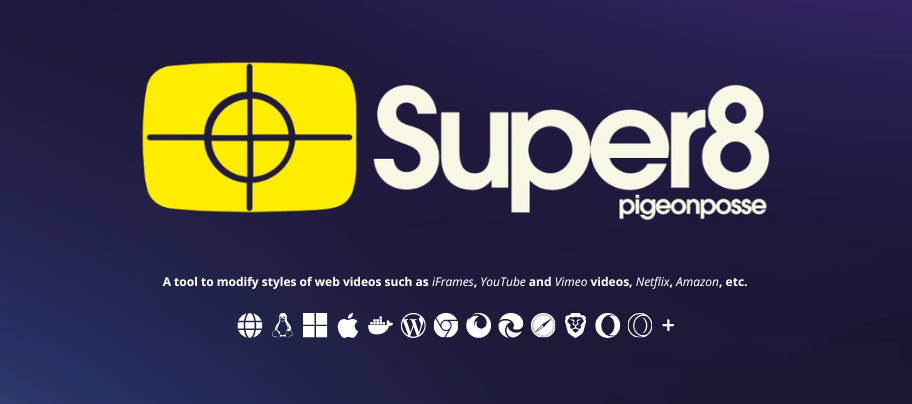

# Welcome to Super 8 Documentation 🎥🎨

## What is Super8?

What exactly is **Super8**? Our tool gives you the ability to adjust a wide variety of visual characteristics, such as contrast, saturation, color temperature, and much more. In other words, you can customize the appearance of website elements to suit your personal tastes and preferences.

## Your Style Customization Tool

**Super8** is much more than just a tool: it's your online personalization companion. Available in multiple formats, **Super8** gives you the flexibility to tailor your web experience exactly how you want.

- 🌐 [**Web Format**](/getting-started#🌐-web): In addition to the options above, we also offer a direct web format, so you can customize visual elements online without the need for extensions or plugins.

- 🧩 [**Browser Extension**](/getting-started#🧩-browser-extension): The **Super8** browser extension, compatible with Chrome and Firefox, takes customization to the next level. You can modify videos from websites such as YouTube & Vimeo, Netflix, Amazon etc, adapting them to your personal preferences.

- 🖥️ [**Desktop app**](/getting-started#🖥%EF%B8%8F-desktop-app)

- 📱[**Mobile app**](/getting-started#📱-mobile-app)

- 🐳 [**Docker image**](/getting-started#🐳-docker-image)

- 🔌 [**WordPress Plugin**](/getting-started#🔌-wp-plugin): If you have a WordPress website, **Super8** comes as a simple plugin. With it, you can customize and adjust the visual elements of your website, giving you complete control over its appearance.
